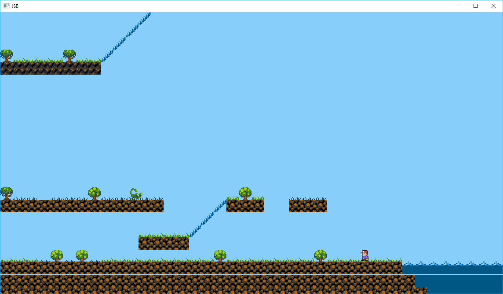
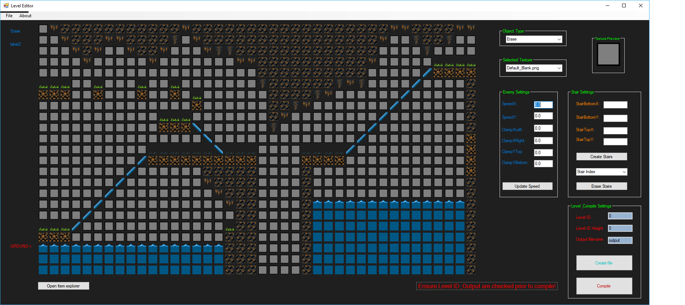

# JSW
Platform game engine in the style of Jet Set Willy - SFML framework for rendering but game engine written from scratch.

<b> 28/03/2021 </b> - Forgot about this! Not working on it anymore spend most of my time working in Unreal. Feel free to use if you can make sense of any of it.

<b> 22/01/2018 </b> - Added some new screenshots of the game and editor

 
<b> 19/12/2018 </b> - Restarted work on this. Will be concentrating on editor improvements. I'll be moving away from a remake and make this an original game in the style of Jet Set Willy

<b>NOTE 10/09/2018</b> - project isn't dead. I've taken a break over summer as I'm working on a CS Course

Currently supports:  
* Collision detection for walls, enemies and collectables  
* Stairs  
* Loading of levels from external file in custom file format  
* Changes levels dynamically  
* Music & sound effect support  
* Textures loaded externally and applied based on the file format  
* Spritesheets (currently a bit hacky and restricted)   
* Level Editor written in c# - currently in pre-alpha but usable  
* Compiler from level editor to game  

Current TODO: 

* <del>Platforms which can be jumped through from the underside and walked on</del> done  
* <del> Stairs </del> done  
* <del> Loading multiple rooms </del> done  
* Ropes - partially done but no collision detection and they do not 'bend' yet  
* <del> improve spritesheets (this wont be done until there is more content!) </del> done more or less    
* <del> Sound support </del> done  
* <del> Refactoring main into a game manager </del> done  
* Gameplay logic, e.g. amount of collectables, lives etc.  
* <del> Level Editor </del> (usable but not feature complete) 

* Content

Latest screenshot having worked on content (graphics from https://opengameart.org/content/simple-broad-purpose-tileset) - note the line is a test rope and the blue tiles under the toilet is a test travelator  
added level editor screenshot

