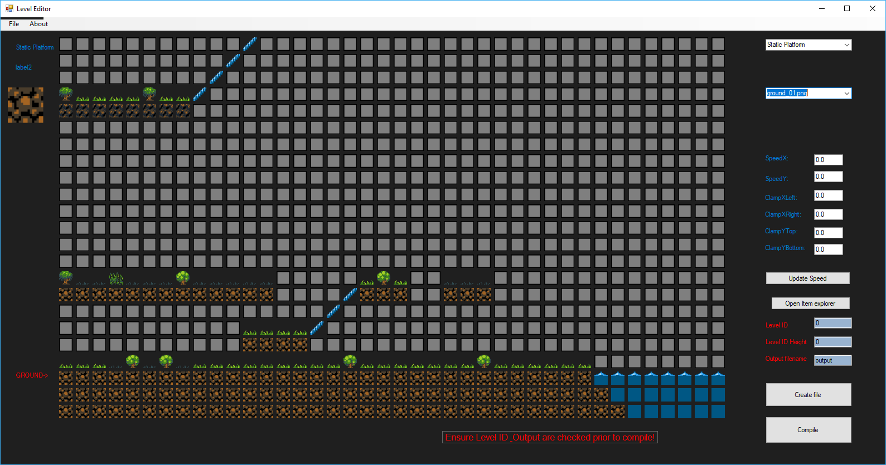

# JSW
Remake of a Spectrum platform game - Lets call it Jet Set Billy - SFML framework for rendering but game engine written from scratch

Going to remake this with a level editor. Used to enjoy this as a child so thought it would be fun to re-make it
currently very early days...

Currently supports:  
* Collision detection for walls, enemies and collectables  
* Stairs  
* Loading of levels from external file in custom file format  
* Changes levels dynamically  
* Music & sound effect support  
* Textures loaded externally and applied based on the file format  
* Spritesheets (currently a bit hacky and restricted)   
* Level Editor written in c# - currently in pre-alpha but usable  
* Compiler from level editor to game  

Current TODO: 

* <del>Platforms which can be jumped through from the underside and walked on</del> done  
* <del> Stairs </del> done  
* <del> Loading multiple rooms </del> done  
* Ropes  
* improve spritesheets (this wont be done until there is more content!)    
* <del> Sound support </del> done  
* <del> Refactoring main into a game manager </del> done  
* Gameplay logic, e.g. amount of collectables, lives etc.  
* <del> Level Editor </del> (usable but not feature complete) 

* Content - currently approx 20 levels partially built

added second screenshot with stairs support. Not much to see. The blue circles represent enemies  
added level editor screenshot

